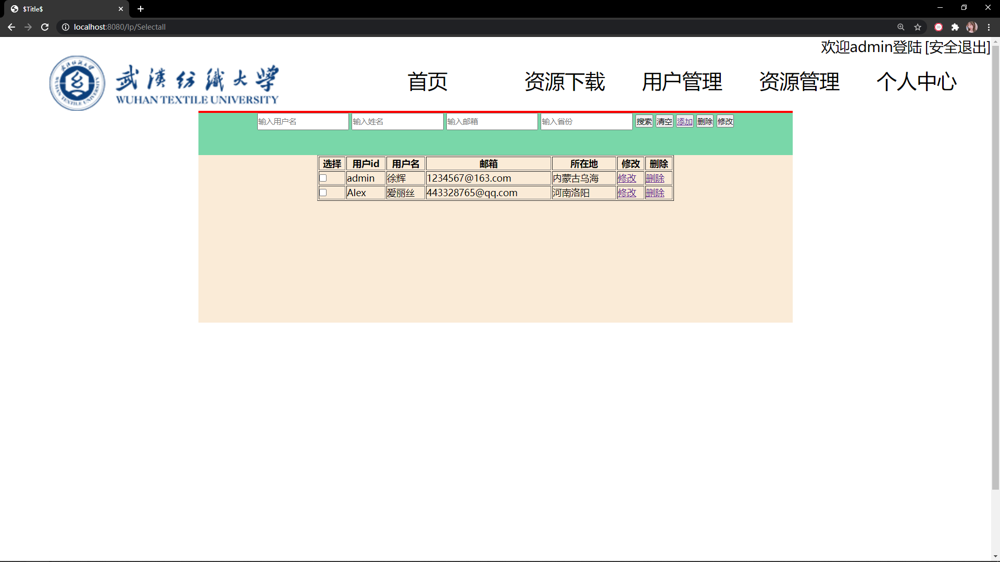
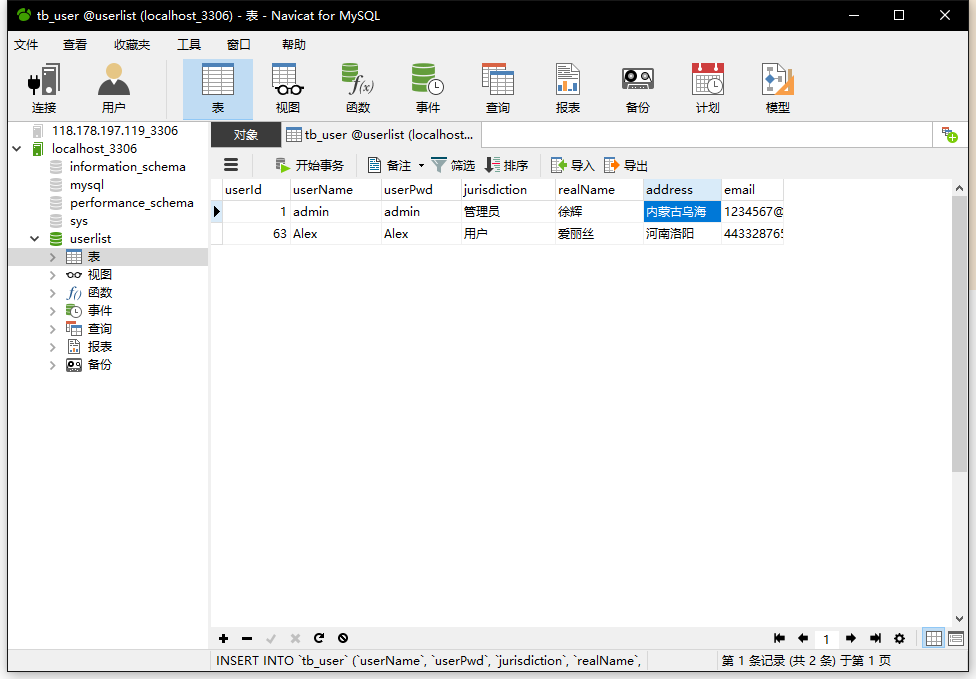
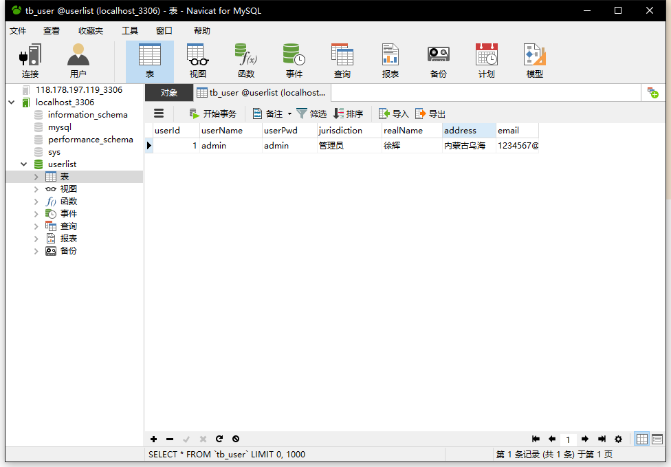
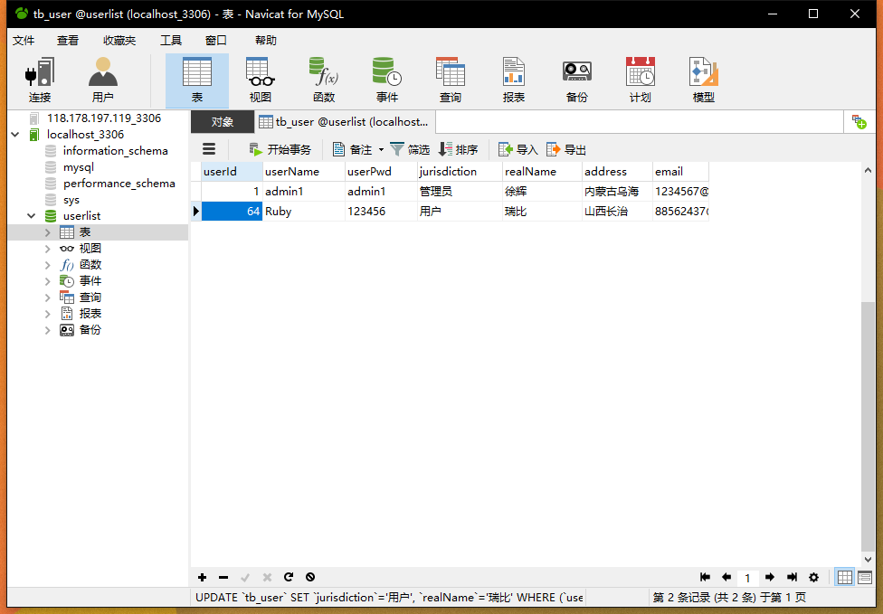
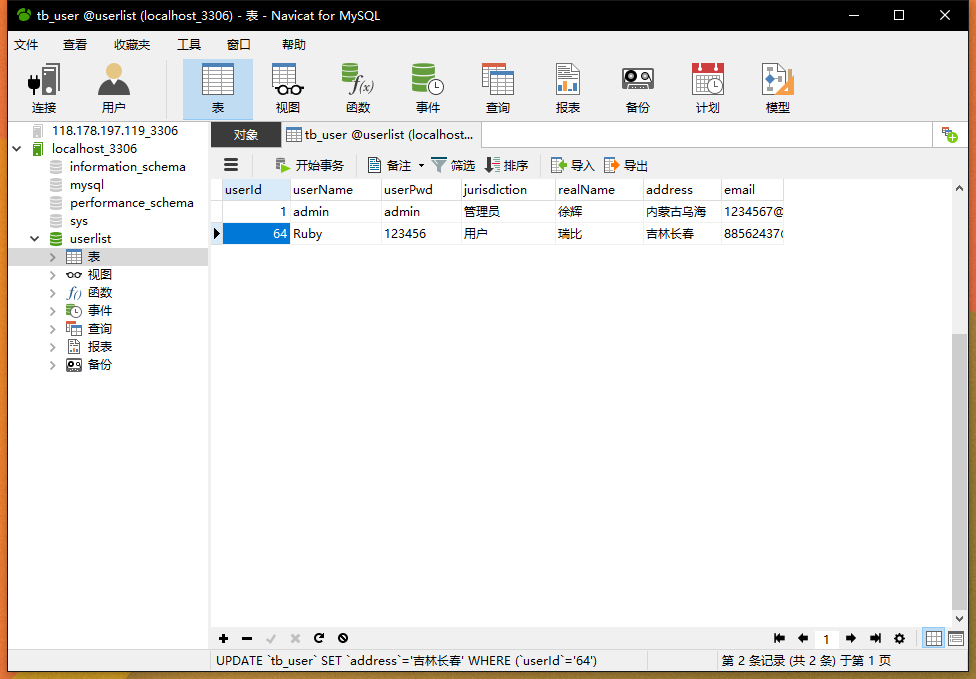
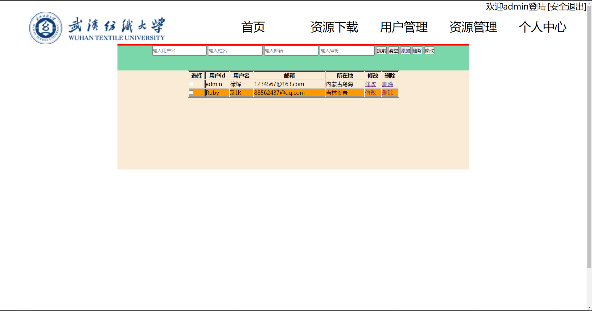

# JavaWebWork4
javaweb第四次作业
<h1>主页面新增查询用户列表功能</h1>  

<h1>选择一个用户删除</h1>  

<h1>删除前数据库数据</h1>  

<h1>删除后页面显示结果</h1>  

<h1>删除后数据库显示结果</h1>  

<h1>点击添加用户</h1>  

<h1>添加一个名为Ruby的用户</h1>  

<h1>添加后页面显示结果</h1>  

<h1>点击添加后数据库数据</h1>  

<h1>点击修改用户信息</h1>  

<h1>修改后数据库显示结果</h1>  

<h1>分页功能未实现(急着交作业....)</h1>  

<h1>结束</h1>
